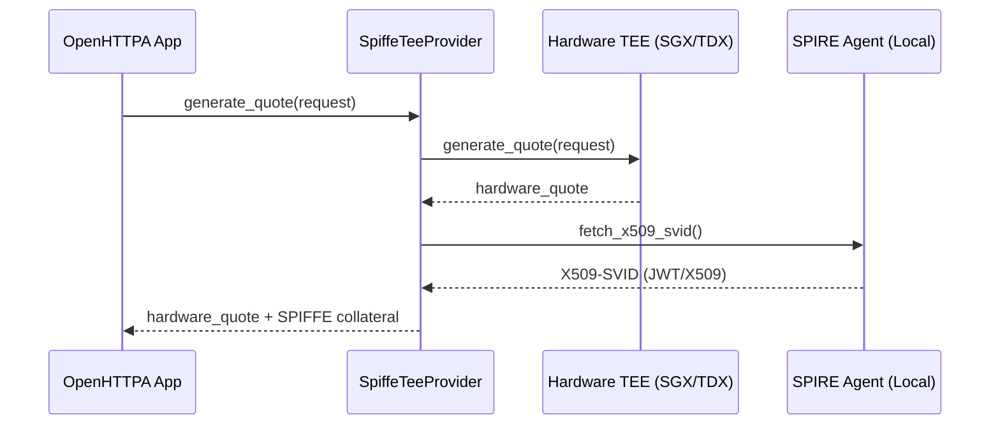

# OpenHTTPA SPIFFE / SPIRE Integration

This crate provides a mechanism to fetch SPIFFE Verifiable Identity Documents (SVIDs) from a local SPIRE agent and bind them into the OpenHTTPA attestation flow, bridging cloud-native identity with hardware trust.

## Usage

You can seamlessly wrap any `TeeProvider` implementation (such as `SgxTeeProvider` or `TdxTeeProvider`) using `SpiffeTeeProvider`.
This injects workload identities as collateral inside your hardware quote.

```rust
use std::sync::Arc;
use openhttpa_spiffe::SpiffeTeeProvider;
use openhttpa_tee::mock::MockTeeProvider;

// Define your hardware provider
let hardware_provider = Arc::new(MockTeeProvider::default());

// Decorate it with SPIFFE integration, pointing to the local SPIRE agent socket
let spiffe_provider = SpiffeTeeProvider::new(hardware_provider, "unix:///tmp/spire-agent/public/api.sock");

// When generating quotes, the SVID is automatically embedded as a collateral URI
// quote.collateral_uris.push("spiffe:svid:...");
```

## Architecture


