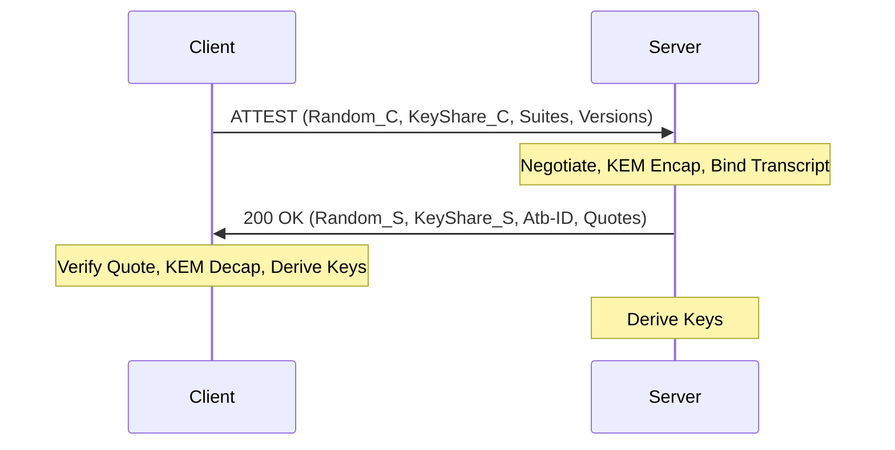

--- abstract

`OpenHTTPA` (Hypertext Transfer Protocol with Attestation) defines a protocol for establishing
hardware-verified, end-to-end confidential and authenticated communication between a client
and a Trusted Execution Environment (TEE) over standard HTTP/2, HTTP/3, and gRPC transports.
Unlike traditional TLS which terminates at the network edge, `OpenHTTPA` ensures that the
cryptographic session terminates inside the hardware-isolated enclave.
The protocol is based on the SIGMA-I model and incorporates post-quantum hybrid key exchange (ML-KEM), post-quantum digital signatures (ML-DSA), transcript-bound hardware attestation, and semantic binding of HTTP requests to the hardware-verified session state.
This document supersedes the earlier work published as {{I-D.sandowicz-httpbis-httpa2}}.

--- middle

# Introduction

Modern web architectures rely on Transport Layer Security (TLS) {{RFC8446}} for data-in-transit
protection. However, TLS termination often occurs at the network edge (e.g., Load Balancers,
CDNs, or WAFs), leaving data exposed within internal cloud networks and vulnerable to
privileged insiders or compromised host software.

Trusted Execution Environments (TEEs), such as Intel SGX/TDX {{INTEL-TDX}}, AMD SEV-SNP {{AMD-SEV}}, and Arm TrustZone,
provide hardware-level isolation. While TEEs can generate cryptographic "quotes" to prove
their identity and integrity, there is no standardized Application Layer (L7) protocol to
seamlessly bind these hardware proofs to HTTP sessions.

`OpenHTTPA` addresses this gap by providing an end-to-end trusted communication protocol. Building upon the foundational concepts of the earlier HTTPA/2 specification (see {{I-D.sandowicz-httpbis-httpa2}}), `OpenHTTPA` introduces:

1.  **Enclave-to-Enclave Security**: Cryptographic termination inside the TEE.
2.  **Mutual Attestation**: Integration of TEE hardware quotes into the handshake via the
    SIGMA-I model.
3.  **PQC Exclusivity**: Enforced Post-Quantum Cryptography for identity and signatures using
    ML-DSA {{FIPS-204}}, completely eliminating classical ECDSA/RSA dependencies for network identity. (Note: Hardware attestation quotes still rely on classical silicon roots of trust, such as TEE-ECDSA, depending on the hardware vendor). Key exchange utilizes a hybrid combiner of classical X25519 with ML-KEM {{FIPS-203}}.
4.  **Policy-as-Code (PaC)**: Dynamic admission control during the Attestation Handshake (AtHS) powered by Open Policy Agent (OPA/Rego) to enforce context-aware rules on hardware provenance and claims.
5.  **Semantic Intent Binding**: The Attested Header List (AHL) mechanism, which binds HTTP
    semantic context (Method, Path, Query) to the hardware-verified session.
6.  **0-RTT Confidentiality**: Sub-millisecond session resumption for latency-critical agentic and oracle workflows.

## Working Group Target

This document is submitted for cross-working-group review:

- **HTTPBIS**: For extensions to the HTTP protocol, including the `ATTEST` method and SFV headers.
- **TEE**: For the use of hardware attestation reports and Entity Attestation Tokens (EAT) {{RFC9334}}.
- **SECDISPATCH**: For architectural review of the hybrid security model.

# Design Goals

`OpenHTTPA` is designed with the following core architectural goals:

1.  **Transport Independence**: The protocol MUST be capable of operating over HTTP/2,
    HTTP/3, and gRPC without modification to the underlying transport framing.
2.  **Cryptographic Agility**: The hybrid KEM and AEAD selections MUST be negotiable to
    allow for the adoption of future post-quantum algorithms.
3.  **Auditability**: The handshake transcript MUST be deterministic and auditable to
    allow for formal verification of security properties.
4.  **Hardware Heterogeneity**: The protocol SHOULD support the simultaneous attestation
    of multiple hardware providers (e.g., CPU + Accelerator) in a single unified session.
5.  **Formal Verifiability**: The protocol state machine and cryptographic binding MUST be
    amenable to machine-checked formal verification (e.g., ProVerif) to guarantee injective authentication and perfect forward secrecy.

# Conventions and Terminology

The key words "MUST", "MUST NOT", "REQUIRED", "SHALL", "SHALL NOT", "SHOULD", "SHOULD NOT",
"RECOMMENDED", "NOT RECOMMENDED", "MAY", and "OPTIONAL" in this document are to be interpreted
as described in BCP 14 {{RFC2119}} {{RFC8174}} when, and only when, they appear in all capitals,
as shown here.

The following terms are used throughout this document:

- **TEE (Trusted Execution Environment)**: A secure area of a main processor that guarantees
  confidentiality and integrity of code and data.
- **Attestation Quote**: A hardware-signed report proving the state and identity of a TEE.
- **AtHS (Attestation Handshake)**: The initial protocol phase to establish a session, based
  on the SIGMA-I model.
- **TrR (Trusted Request)**: An encrypted HTTP request sent over an established AtHS session.
- **AHL (Attested Header List)**: A canonical representation of the request headers used for
  semantic binding.
- **Hybrid KEM**: A Key Encapsulation Mechanism that combines a classical and a
  post-quantum primitive to achieve IND-CCA2 security.

# Protocol Overview

`OpenHTTPA` operates in several distinct phases, integrated into the standard HTTP request-response
lifecycle.

## Phase 1: Preflight (Capability Negotiation)

A client MAY initiate a preflight request using the `OPTIONS` method to discover `OpenHTTPA`
support and available hardware providers.

```http
OPTIONS /api/resource HTTP/1.1
Host: server.example.com
Attest-Versions: openhttpa
```

The server responds with supported versions and hardware types using Structured Field Values
{{RFC8941}}.

```http
HTTP/1.1 204 No Content
Attest-Versions: openhttpa
Attest-TEE-Types: intel_tdx, nvidia_gpu
```

## Phase 2: Attestation Handshake (AtHS)

The AtHS establishes a secure session between the client and the TEE. It uses the `ATTEST`
method (or a fallback `POST` with specific headers).

### AtHS Request

The client sends its preferred cipher suites, versions, nonces, and public key shares.

- `Attest-Versions`: Supported versions. (Omitted if `Attest-Encrypted-Hello` is used).
- `Attest-Cipher-Suites`: Preferred hybrid suites (e.g., `X25519_ML_KEM768_AES256GCM_SHA384`). (Omitted if `Attest-Encrypted-Hello` is used).
- `Attest-Random`: 32-byte client nonce.
- `Attest-Key-Shares`: Structured list of ECDHE and ML-KEM public keys.
- `Attest-Encrypted-Hello`: (Optional) ML-KEM HPKE-encapsulated metadata shielding cipher suites, protocol versions, and routing identifiers from network observers to provide cover-traffic metadata protection.
- `Attest-Policies`: (Optional) A list of PaC (Policy-as-Code) constraints evaluated dynamically via Open Policy Agent (OPA) against the server's hardware provenance.

### AtHS Response

The server responds with the selected parameters and its own attestation evidence.

- `Attest-Version`: Negotiated version.
- `Attest-Cipher-Suite`: Negotiated suite.
- `Attest-Random`: 32-byte server nonce.
- `Attest-Quotes`: One or more TEE attestation quotes.
- `Attest-Server-Signatures`: Post-quantum and hardware-backed digital signatures (e.g., ML-DSA, TEE-ECDSA).
- `Attest-Base-ID`: Unique session identifier (UUID).

## Handshake Flow Visualization

The following diagram illustrates the AtHS SIGMA-I handshake:



# Message Formats

To ensure cross-platform interoperability, `OpenHTTPA` defines strict formats for all wire
elements.

## Structured Field Values (SFV)

All `OpenHTTPA` headers MUST follow {{RFC8941}}.

### Attest-Versions

A List of tokens identifying supported protocol versions.

- Example: `Attest-Versions: openhttpa, httpa/3`

### Attest-Cipher-Suites

A List of tokens identifying supported cipher suites in order of preference.

- Example: `Attest-Cipher-Suites: X25519_ML_KEM768_AES256GCM_SHA384, X25519_AES256GCM_SHA384`

### Attest-Random

An SFV Byte Sequence containing 32 random bytes.

- Example: `Attest-Random: :b3Blbmh0dHBhLXNlY3VyZS1yYW5kb20tbm9uY2UteHh4: `

### Attest-Quotes

A List of Inner Lists. Each inner list contains a TEE type token and an SFV Byte Sequence representing the quote. The byte sequence MAY include a `format` parameter (e.g., `format=eat`) to specify the encoding of the quote; if absent, `format=raw` is assumed.

- Example: `Attest-Quotes: (tdx :YmFzZTY0LXF1b3RlLWJ5dGVz:;format=raw), (nvidia_gpu :Z3B1LXF1b3RlOjpieXRlcw==:)`

#### Entity Attestation Token (EAT) Considerations

While `OpenHTTPA` explicitly prioritizes sub-millisecond setup performance utilizing **raw hardware quotes** (e.g., native Intel TDX {{INTEL-TDX}} or AMD SEV-SNP {{AMD-SEV}} binary formats) for latency-critical Agentic Swarms, it is imperative to support broader Internet interoperability.

Therefore, implementations MUST support an Entity Attestation Token (EAT) {{RFC9334}} fallback. The client and server can negotiate the EAT format via the `format=eat` parameter. When EAT is utilized, hardware evidence is encapsulated within CWT/JWT structures, allowing disparate verifiers to evaluate claims using standardized engines (e.g., Veraison).

## JSON Key Shares

The `Attest-Key-Shares` and `Attest-Key-Share` headers contain a JSON-encoded object with
the following schema:

```json
{
  "ecdhe_public": "base64_encoded_bytes",
  "mlkem_public": "base64_encoded_bytes",
  "mlkem_ciphertext": "base64_encoded_bytes (server response only)",
  "server_identity_pub": "base64_encoded_bytes (optional server response)",
  "signature_alg": "string (e.g., 'ml-dsa-65')"
}
```

# Test Vectors

> **Note to RFC Editor:** The following test vectors were generated from the OpenHTTPA reference implementation (`openhttpa-rs`).

## Hybrid KEM Key Exchange

**Client ECDHE Public Key:**

```text
7837c04985b1737863fc4bb7e3e18a0ff55dc9815865877676977f69d0c8851a
```

**Client ML-KEM Public Key:**

```text
47a226263994c1677422005a2345508546a4c1049e9af576b582a2
31db5a354a5b7290a4cacc22c18322fd45729527a0b8584bfe0b12
48634f6016ad6e39ad5d229869e9cd00ba06f755557df266f0a52f
393b6734ecc4ee696f4b761b3f6088eed895ebb81f0d66c97b8361
fad9cb5583ac02a9734286bc74e28e6484bc229332e0f00c5f471a
09648610daa11e48be1cf08cc4bc84902713432468816533a24433
786c20f0231b7eac413753a3ae3a19d0c817b79451a9817f787694
2d53b6ccec6a6784c7c2d84929039a67a0c26cbb5875ba0432686f
ee7227e95b14c6494c517c1214b59cbbbb06fe996447203e8fe27a
48996613674a826674564a4c11c5055e3679d686b30233a84c4ab4
6c07c764fcbc4a646972dc16c895bdde9c575d86bcd3d35baf3952
0e967d286c8af44763a856926e7534a4f488ca403e1bb7baff4c6d
41230f67a590453891fc6730d63bcac141954d32ae37ebca96b244
09922a234b3b486c3f9a602e13337ae9f1a4a8c2137ac6481f32bb
7e34cd3f97cd00d9ae92dc187fb00c78384b669443d2377e79b82f
5890037fcacd64952003b1b3589968b3725763f79f4618491bb274
26e96fac824dbe93828bea31572a8852139e46806121652c7673ce
1b659e8249bcc102ac39a768322a62f85b6b25c74a12126336d05d
a992c8a0729e7f97909591c816b0c98366600fa7053c29c530a546
c3c92b705144f153b949f6bf9a43cbb2141572c9251b43c3507769
78b8cdb19ba642695c3242207260934dd1707d12662a666790bb68
16292f67cc19a416c17a01828be46005dc6b1319b551899044b44c
8bc80b0ac329e61c60a00279ac87a5ff03697d501c9d79b6945a0b
04e95f8654ad8f5b72e431b339a909fb5cce6652991762cf377800
9fd53e0896b47c725b9ddbbc9ae63b6e1b8ff184880b156b4b3626
d6cb9ebd8b37ba5b63bada72fdd58adff49be0f736242bb219b643
0f700d99c5a87d8109ede8211c5bc5fb85762b843c9e6aa9750685
d5f4442b9ba0d3e07fa7f10628abaaefd0555d63cd437b3ea36894
bd21731763b194c0a1f9746838845bfaf8159278b255f14bdd00ac
82e05b2d90cd52f57388b8036c7ac0feccc0a3b975419756e8bb5d
e36ba25bf18dc1931663f3afaf08c9f4d7b533097723f1a3be260f
d34ac968795f82c51ebb5b081385546c82a41924ac7ac672b5ec61
78b3310661b9017a8f37823f1da3cf7c384e00389685ac584b0b33
9f96899b707d4928a5831972479750a39ac6852514a96b9f81f541
b6cba6aea7a23f911c939b050f9b239026c825b4b7b978cbb10951
a7d3bccd442641a184e5425a0224421d48c082acc8afc215e0aa20
1cca63bfd056678b311cbc0fcbb5144320a91a963952b227b3a8cf
a71c562cb5a844295c2e20520118943bc6bdf50392f8391f9d81ca
bf18c82c1ba194a27131b16b06952b80d4055e0a6767431cd0f61f
ba43698b590912c2b6463688bfd99e099a4519061ea4230e72b794
c9114fd91c59a5c8585ed65f622a42004c6e11b086db272bbcb4c5
3c7c8abcfa69d730bfe0b4857bd61c0f6a37be496e0063a5dc6145
e26a4f931b3e261a52233244a6028c34b2ccadea1c400df39ed0a8
f8c4047ed3ceeda48a6d7b29a0553d35706fde12858da5
```

**Server ECDHE Public Key:**

```text
cfff07624272cf8303edd7d71ea3bea1b359008c321ae06f076ed52200047418
```

**Server ML-KEM Ciphertext:**

```text
34b21199544efdba9cb4a0f832f61cf922983b52c7c3d042484986
26d1e0a17565e81581a1d0017f453cb3bb19acf5c2f6340b338114
e460a222bf0b1d339299820ab97e1b7645b0bf2b6ed917dc9c0093
5d3acf1a829155e1df2651785c8e91205b95f48d77198cd77854e2
92f84ee483d0ad97075d175e346c4a5c261746f2116b5b5b176401
cd37f7521a277705bb1574e0a6f8e9614d8691a78bef730f93e04c
b10f114cc217550f083ab6a51b7ef1388026af3ca9b9f191127ff3
dde9aa8f4e7ed8d30bd948fde3f8348a3506be7b1cee85f670379d
17af5b5ac797a4987356d500444c01f145c2ddbb3ecbb54ac08456
ee07ae8770156b0a303c4841ccc6f03e82d79dfb3b78a2d7f15c6f
c79af454e051a80cb7508474d2fdbdf400100fea583316854d28e5
faee57cd7ce15dbd3609d14d16f4b7944c43d35e2afc0d5c443c69
125a471405215fde928dd27b26bd641dce55e78d1d4c1ed12f9d09
f03ffc6698f1573659c72ace12ff8428d972db6381727b40097c4f
ae0a1b89faf7e0e8371dc451c2221120be73731cc5428cff83ee09
d212df32020af7677c24973796970480d647c24f5d88f4a33b4e6f
f77e3db809d9ae8684ed31a4075b536aeb8f789ce65075c7096cfe
de20377cc9b4ff47973c22a0d9aa429207d36fc0a3ea24ca3c0b92
c93af6a31f87cea8b20bdd81cb63db603bd3f012697194bb2f3068
592b331a81ecd589510902d0356ef88c107b154b52e5617e2859a0
1b3f40151c7067221328f53f2f84429f4ccd99eb4981f96fcaae5f
30f4caa1dd66eee2902714c35f4eacc0e7a32a382a36ca4ce532c4
89471d39b21ad1d9be3edc8dd5df16572fc93dbbd4f06cfab00bad
fd313e0b6b09c0dac2c491b70edf5eb3170cd65e6f72219496c986
637676d6c80a2f6197c60c854f297476c05ef4565d5b9ddd2b79ea
2e04ea0107d64a53fdb0d485f83983957b6985b36d1a6e24a062b5
fd15fb9c20a00a74f2a8146f0c2d0c611d272d5d65c0495d954349
542e94c5e23bd37ceaf5cc512a1c49ce84c08d7de7ff5015a1e42c
2c9ea65e0f9187b20c1576daaad1fe1203975bbd611d52ca71eb22
85e026c0f4cb166740f68158516d5e0484a7097c00bc8a8370b00f
3fa1673be7f27ef098f664dd0406dbcca7e11cae9ce27b0dd4cb31
4c098b65ab9f698c0ebd9ca23969a1bdb7e1cf9a15dcbfac5d935c
785d7b94fd77fe862d9c149666b8ea4bd75116fb4da8dd3510be5a
2b2cf2cd5f158bcdbcf567d8c2a4288120db5fa459f54f2c8188d9
61436219ac5d2da7dea94246f2aa6dc3a165cc6a8ceaa45a62b303
f4dd7d6dddfeb7f02beba9a41e22b60d006f6cb6ed2f9b17a3d4a1
2d200d1b432f9e08d629418a625f0f5dad3b6af69ca167d58aac86
88eb20ab4ea5e68d589aa89f6da920decf07d382a2ac4937df1f23
6da2316174ef70b145c211e1a002201079c507d4ca4d5867acfdd5
b32619e192928522cefc4f943e552f349000a3fb092274bb09de10
5b7905edff03f7ad
```

**Combined Hybrid Secret (IKM):**

```text
0f59c9666c406b1623a6759955670303871d1d7edd333596df998f8e2c5bef58
```

### Derived Session Keys

_Transcript Hash (All Zeros for Test Vector):_

```text
0000000000000000000000000000000000000000000000000000000000000000
00000000000000000000000000000000
```

**Master Secret:**

```text
e4c42f6ce7dd16b5d7c0dbbe632df194df2c66c2c23684149915028d521f120c
aa4ba423f91a7c33e508c301ee828b58
```

**Client Write Key:**

```text
00b0652de62e2ca2a59b9278c0394968fcf8f3c51201673f48b60aaa6025ce17
```

**Server Write Key:**

```text
45682e8d7d91daae8ed44f309fb141e3f1feb3a7809139d86b818e7d42a58caa
```

**Client MAC Key:**

```text
b027a1f5a0a45b5298bc3c97078d5914e8e924b426dcd5d2b96b47b0521a307e
```

**Server MAC Key:**

```text
f66f2e32e43af2be6775ebb2c5915f0c98fe1e5c54c68320447964d7a70ac80f
```

## Binary Trailer Layouts

Trailers MUST use big-endian encoding for all numeric fields.

### Attest-Ticket (Request Trailer)

Used in TrR (Phase 4) to authenticate the request.

- `nonce`: 8 bytes (big-endian u64).
- `mac`: Variable length (based on cipher suite, e.g., 48 bytes for SHA-384).

### Attest-Binder (Response Trailer)

Used in TrR (Phase 4) to bind the response to the request.

- `request_nonce`: 8 bytes (big-endian u64, echo of request nonce).
- `mac`: Variable length.

# Protocol State Machine

Implementations MUST maintain a session state machine to ensure correct sequencing of
handshake and trusted request phases.

## Client State Machine

| Current State | Event        | Next State  | Action                         |
| ------------- | ------------ | ----------- | ------------------------------ |
| START         | Send OPTIONS | PREFLIGHT   | Wait for preflight response    |
| PREFLIGHT     | Recv 204     | IDLE        | Parse supported versions/TEEs  |
| IDLE          | Send ATTEST  | HANDSHAKE   | Generate KEM pair, send shares |
| HANDSHAKE     | Recv 200     | ESTABLISHED | Verify quotes, derive keys     |
| ESTABLISHED   | Send TrR     | ESTABLISHED | Encrypt body, add AHL binder   |

## Server State Machine

| Current State | Event        | Next State  | Action                           |
| ------------- | ------------ | ----------- | -------------------------------- |
| START         | Recv OPTIONS | START       | Send supported capabilities      |
| START         | Recv ATTEST  | HANDSHAKE   | Pick suite/version, generate KEM |
| HANDSHAKE     | Send 200     | ESTABLISHED | Send quotes/shares, derive keys  |
| ESTABLISHED   | Recv TrR     | ESTABLISHED | Verify AHL, decrypt body         |

# Cryptography

`OpenHTTPA` mandates high-assurance primitives and constructions to protect against both classical
and future quantum adversaries. All signatures MUST use ML-DSA-65 or higher for post-quantum
identity assurance.

## Hybrid KEM Combiner

To achieve IND-CCA2 security, `OpenHTTPA` implements a hybrid combiner following
{{I-D.ietf-tls-hybrid-design}} §3.2.

### Combiner Input (IKM)

The Input Key Material (IKM) binds all public material from the exchange. All length prefixes (`u16`) MUST be encoded as Big-Endian (network byte order):

```text
IKM = ECDHE_SS || ML-KEM_SS || u16(len(label)) || label
      || u16(len(ECDHE_PK_client)) || ECDHE_PK_client
      || u16(len(ECDHE_PK_server)) || ECDHE_PK_server
      || u16(len(ML-KEM_EK_client)) || ML-KEM_EK_client
      || u16(len(ML-KEM_CT)) || ML-KEM_CT
```

The `label` MUST be `b"openhttpa hybrid kem v1"`.

### Combined Secret Derivation

1.  `PRK = HKDF-Extract(salt=[0;32], IKM)`
2.  `Secret = HKDF-Expand(PRK, info=b"combined", 32)`

## Session Key Schedule

The key schedule follows {{RFC5869}} and is aligned with {{RFC8446}} §7.1.

### HKDF-Extract

```text
Handshake_PRK = HKDF-Extract(Hash=SHA-384, salt=[0x00;48], IKM=combined_secret)
```

### HKDF-Expand

```text
OKM = HKDF-Expand(Hash=SHA-384, PRK=Handshake_PRK,
                 info=b"openhttpa v2 " || label || transcript_hash, L=<length>)
```

The fixed 48-byte length of the `transcript_hash` (SHA-384 output) ensures unambiguous domain separation between the `label` and the `transcript_hash` without the need for a delimiter.

## Key Schedule Visualization

The following diagram illustrates the hierarchical derivation of session keys:

```text
       Combined Hybrid Secret
                 |
          HKDF-Extract(salt=[0;48])
                 |
          Handshake_PRK
        /        |        \          \
HKDF-Expand  HKDF-Expand  HKDF-Expand  HKDF-Expand
(Label=Master) (Label=Write) (Label=MAC) (Label=Res Master)
      |          |           |            |
Master Secret  Write Keys    MAC Keys     Resumption
               (C->S, S->C)  (C->S, S->C) Master Secret
```

# Session Resumption (TrR)

To avoid the computational overhead of hybrid KEM handshakes, `OpenHTTPA` supports session
resumption using opaque tickets.

## Ticket Format

The `Attest-Ticket-Resumption` header contains a server-encrypted blob (AtST) containing:

- **Protocol Version**: 1 byte.
- **Cipher Suite**: 2 bytes (big-endian).
- **Master Secret**: 48 bytes (from the original session).
- **Session Expiry**: 8 bytes (Unix timestamp).
- **Hardware Context**: Opaque TEE measurement/policy record.

## 0-RTT Confidentiality

To achieve the required `< 5ms overhead` SLA in distributed Agentic Swarms, clients MAY utilize 0-RTT session resumption. By reusing the Master Secret and TEE state from a previously established 1-RTT handshake (via the `Attest-Ticket`), the client can transmit encrypted Trusted Requests (TrR) within the first flight of a connection (e.g., within HTTP/3 QUIC early data).

### 0-RTT Cryptographic Binding

1. The client derives an early `Handshake_PRK` using the decoupled `Resumption Master Secret` from the opaque ticket.
2. Early session keys are expanded utilizing a specialized label: `openhttpa_v2_0rtt` and a newly generated 16-byte random salt.
3. The server validates the ticket, enforces safe methods, and transparently decrypts the 0-RTT request.

### 0-RTT Forward Secrecy Limitations

Similar to TLS 1.3 early data (Section 8 of {{RFC8446}}), 0-RTT requests do not provide perfect forward secrecy against an attacker who compromises the `Resumption Master Secret` of the parent session. If the server's long-term hardware secrets or the specific session's resumption secret are compromised, the 0-RTT data sent on that connection could be decrypted. Clients SHOULD NOT send highly sensitive data (e.g., identity credentials or financial transactions) in 0-RTT payloads.

### 0-RTT Replay Protection

0-RTT resumption MUST ONLY be permitted for safe, idempotent HTTP methods (e.g., `GET`, `HEAD`, `OPTIONS`). If a client attempts to use 0-RTT with an unsafe method (e.g., `POST`, `PUT`, `DELETE`), the server MUST reject the request and return a `425 Too Early` status code.

Furthermore, because 0-RTT payloads are susceptible to network-level replays before the server can inject a fresh nonce, the server MUST maintain a sliding-window strike register (replay cache) of all nonces observed across all recently active resumed sessions within the ticket expiry window.

# Agentic Swarms & Multi-Hop Provenance

Autonomous Agentic Swarms require mutually authenticated, hardware-verified communication channels to perform automated transactions without human oversight. `OpenHTTPA` enables an Attested Agent Mesh (AAM) by maintaining cryptographic provenance across multi-hop agent delegations.

## Attest-Provenance

The `Attest-Provenance` header provides a chain of custody representing all participating agents in a multi-hop request. Each agent in the routing path MUST append its own hardware identity (derived from its TEE quote) to the provenance list before forwarding the request.

- Example: `Attest-Provenance: "agent-a-hash", "agent-b-hash"`

This enables the final receiving service to mathematically verify not only the immediate sender, but the entire chain of trust, ensuring no unverified intermediary altered the request.

# Confidential Oracle Extension

The `OpenHTTPA` Confidential Oracle Extension enables a TEE-based agent to act as a "Trustless Bridge"
between Web2 APIs and Web3 environments (e.g., Bitcoin, EVM). This extension ensures
that off-chain data is fetched, processed, and cryptographically bound to the hardware
evidence before being transmitted to an on-chain verifier.

## Protocol Binding

When an Oracle fetch is performed, the TEE MUST bind the resulting data to the current
AtHS session transcript. This is achieved by computing a SHA-512 digest over the full `transcript_hash` combined with a domain prefix, and placing it in the 64-byte hardware report data (e.g., the `REPORT_DATA` field in Intel TDX or `REPORT_DATA` in Intel SGX).

The 64-byte `ReportData` structure is defined as follows:

```text
ReportData = SHA-512(Domain_Prefix || Transcript_Hash)
```

The `Domain_Prefix` MUST be the ASCII string `"openhttpa hs server"` or `"openhttpa hs client"`. By computing a full SHA-512 over the concatenated prefix and transcript hash, the protocol perfectly utilizes the 64-byte `REPORT_DATA` register available in modern TEEs. This guarantees 256-bit collision resistance against quantum adversaries (e.g. BHT algorithm) and completely avoids the weaknesses of truncation.

## On-Chain Verification

The Oracle response incorporates a hardware quote and, optionally, a ZK-STARK proof
(e.g., generated via RISC Zero) that proves the integrity of the data transformation.
Smart contracts verify:

1.  **Handshake Consistency**: The `transcript_hash` in the quote matches the session.
2.  **Hardware Integrity**: The quote was generated by a valid TEE (verified via DCAP/SNP).
3.  **Data Correctness**: The ZK proof (if present) confirms that the Web2 payload
    correctly corresponds to the claimed on-chain state.

# Semantic Binding via AHL

The Attested Header List (AHL) prevents semantic re-routing attacks.

## AHL Transcript Construction

The AHL transcript MUST use length-prefixed binary fields:

```text
AHL_Transcript = 7::method || len(method_val) || : || method_val
                 || 5::path || len(path_val) || : || path_val
                 || 10::authority || len(authority_val) || : || authority_val
                 || [ len(HEADER_NAME_N) || HEADER_NAME_N
                    || len(HEADER_VALUE_N) || : || HEADER_VALUE_N ... ]
```

Header names MUST be converted to lowercase ASCII and then sorted lexicographically before encoding, similar to the canonicalization rules in HTTP Message Signatures (RFC 9421).

## Binder Calculation

`Binder = HMAC-SHA-384(mac_key, AHL_Transcript)`

The `mac_key` used depends on the sender: the client MUST use the `client_mac_key`, and the server MUST use the `server_mac_key`.

# Error Handling

`OpenHTTPA` implementations MUST use appropriate HTTP status codes and extended error headers.

| Error Condition               | Status Code | Extended Error Code          |
| ----------------------------- | ----------- | ---------------------------- |
| No Mutually Supported Suite   | 406         | `negotiation_failed`         |
| Attestation Verification Fail | 403         | `handshake_integrity_failed` |
| Key Derivation Failure        | 500         | `key_derivation_failed`      |
| Policy Violation (e.g. SVN)   | 403         | `policy_violation`           |

# Formal Verification and Implementation Considerations

To guarantee the high-assurance required for Confidential AI and Web3 Oracles, implementations of `OpenHTTPA` SHOULD adhere to the following strict guidelines:

1. **Formal Modeling**: Core protocol models MUST maintain ongoing machine-checked formal verification (using frameworks like ProVerif or Tamarin) proving perfect forward secrecy and injective authentication against both classical and post-quantum Dolev-Yao adversaries.
2. **Memory Safety**: Implementations SHOULD be authored in memory-safe languages (e.g., Rust) to eliminate classes of vulnerabilities related to buffer manipulation during parsing of untrusted network inputs.
3. **FIPS 140-3 Readiness**: Underlying cryptographic primitives and random number generators MUST be sourced from validated or validateable modules (e.g., `aws-lc-rs` or `BoringSSL`) to ensure enterprise compliance.

# Security Considerations

## Transcript Integrity

`OpenHTTPA` relies on the integrity of the handshake transcript. Every field in the transcript,
including nonces, public keys, and negotiated parameters, MUST be length-prefixed to prevent
canonicalization attacks.

## Hardware Splitting Attacks

Implementations MUST verify that the same transcript hash is bound to all hardware quotes
provided in the `Attest-Quotes` header (e.g., both Host CPU and GPU quotes).

## TEE Vulnerabilities and Revocation

The protocol supports Attestation Revocation Lists (ARL) and Secure Version Number (SVN)
enforcement to mitigate TEE-specific vulnerabilities.

## Replay Protection

To prevent replay attacks during the Trusted Request (TrR) phase, servers MUST mandate strict replay protection for the `nonce` provided in the `Attest-Ticket` request trailer. The server MUST either enforce a strictly increasing monotonic counter for nonces within a session, or maintain a sliding-window strike register (replay cache) of recently seen nonces.

In large-scale distributed deployments where global state synchronization is impractical within latency bounds, servers MAY utilize clustered strike registers combined with strictly bounded time-windows, or issue single-use session tickets for 0-RTT to mitigate the complexity of distributed replay detection.

# Privacy Considerations

## Attestation Fingerprinting

Hardware attestation quotes MAY contain unique identifiers (e.g., CPU serial numbers,
unique entity IDs) that allow for the tracking and fingerprinting of TEE instances.
Implementations SHOULD use privacy-preserving attestation technologies, such as
Enhanced Privacy ID (EPID) or Intel SGX Quote Verification Enclaves, to minimize the exposure
of stable hardware identifiers.

## Provenance Tracking

The `Attest-Provenance` header provides a chain of custody for multi-hop agent delegation.
While essential for security auditing, this chain reveals the topology of the agent mesh.
Implementations MUST ensure that provenance data is only transmitted within established
`OpenHTTPA` sessions to prevent leakage to unauthorized observers.

# Implementation Status

> **Note to RFC Editor:** Please remove this section before publication.

This section documents the current implementation status of `OpenHTTPA` as of May 2026.

- **OpenHTTPA Reference Implementation**: A production-grade Rust implementation is available
  at `https://github.com/openhttpa/openhttpa-rs`. It supports Intel TDX, AMD SEV-SNP, and
  NVIDIA Hopper GPU attestation.
- **Go/Python/Node Bindings**: Language bindings are provided for seamless integration
  into existing cloud-native stacks.
- **Formal Models**: Symbolic and temporal security models have been validated using
  {{ProVerif}} and {{Tamarin}} Prover.

# Acknowledgements

The authors would like to thank the contributors to the The `OpenHTTPA` Foundation (openhttpa.org) and the IETF
Security area for their feedback on early iterations of this protocol.

# Contributors

The following individuals have contributed to the design and implementation of `OpenHTTPA` and its predecessor HTTPA/2:

- **Shih-han Wang**: Original HTTPA/2 Co-Author
- **Nick Li**: Original HTTPA/2 Co-Author
- **Ned Smith**: Original HTTPA/2 Co-Author
- **Krzysztof Sandowicz**: Original HTTPA/2 Co-Author

# IANA Considerations

## HTTP Method Registry

This document requests the registration of the `ATTEST` method in the "HTTP Method Registry".

| Method | Safe | Idempotent | Reference     |
| ------ | ---- | ---------- | ------------- |
| ATTEST | No   | No         | This document |

## HTTP Field Name Registry

This document requests the registration of the following headers in the "Hypertext Transfer
Protocol (HTTP) Field Name Registry":

| Field Name                       | Template | Reference     |
| -------------------------------- | -------- | ------------- |
| `Attest-Cipher-Suites`           | SFV      | This document |
| `Attest-Supported-Cipher-Suites` | SFV      | This document |
| `Attest-Cipher-Suite`            | SFV      | This document |
| `Attest-Supported-Groups`        | SFV      | This document |
| `Attest-Key-Shares`              | SFV      | This document |
| `Attest-Key-Share`               | SFV      | This document |
| `Attest-Random`                  | SFV      | This document |
| `Attest-Encrypted-Hello`         | SFV      | This document |
| `Attest-Policies`                | SFV      | This document |
| `Attest-Base-Creation`           | SFV      | This document |
| `Attest-Blocklist`               | SFV      | This document |
| `Attest-Versions`                | SFV      | This document |
| `Attest-Supported-Versions`      | SFV      | This document |
| `Attest-Date`                    | SFV      | This document |
| `Attest-Signatures`              | SFV      | This document |
| `Attest-Server-Signatures`       | SFV      | This document |
| `Attest-Transport`               | SFV      | This document |
| `Attest-Quotes`                  | SFV      | This document |
| `Attest-Base-ID`                 | SFV      | This document |
| `Attest-Version`                 | SFV      | This document |
| `Attest-Expires`                 | SFV      | This document |
| `Attest-Secrets`                 | SFV      | This document |
| `Attest-Cargo`                   | SFV      | This document |
| `Attest-Ticket`                  | SFV      | This document |
| `Attest-Binder`                  | SFV      | This document |
| `Attest-Base-Termination`        | SFV      | This document |
| `Attest-Challenge`               | SFV      | This document |
| `Attest-Provenance`              | SFV      | This document |
| `Attest-Ticket-Resumption`       | SFV      | This document |
| `Attest-Zk-Proof`                | SFV      | This document |
| `Attest-Ai-Provenance-Proof`     | SFV      | This document |

## OpenHTTPA HKDF Labels Registry

This document establishes a new IANA registry titled "OpenHTTPA HKDF Labels" to prevent namespace collisions with TLS. The following labels are registered for use with HKDF expansion in OpenHTTPA.

| Label               | DTLS-OK | Reference     |
| ------------------- | ------- | ------------- |
| `openhttpa_v2`      | Y       | This document |
| `openhttpa_v2_0rtt` | Y       | This document |

Furthermore, the following specific key slots are logically prefixed by the protocol label:

- `master secret`
- `res master`
- `client write key`
- `server write key`
- `client write iv`
- `server write iv`
- `client mac key`
- `server mac key`

## TEE Type Registry

This document establishes a new IANA registry titled "`OpenHTTPA` TEE Types".

| TEE Type Token | Description                    | Reference     |
| -------------- | ------------------------------ | ------------- |
| `sgx`          | Intel SGX (Software Guard Ext) | This document |
| `tdx`          | Intel TDX (Trust Domain Ext)   | This document |
| `sev_snp`      | AMD SEV-SNP                    | This document |
| `trustzone`    | Arm TrustZone                  | This document |
| `nvidia_gpu`   | NVIDIA Hopper/Blackwell GPU    | This document |
| `tpm`          | Trusted Platform Module 2.0    | This document |

## OpenHTTPA Extended Error Codes Registry

This document establishes a new IANA registry titled "OpenHTTPA Extended Error Codes".

| Error Code                   | Description                                    | Reference     |
| ---------------------------- | ---------------------------------------------- | ------------- |
| `negotiation_failed`         | No mutually supported cipher suite or version. | This document |
| `handshake_integrity_failed` | Quote verification or transcript MAC failed.   | This document |
| `key_derivation_failed`      | Failed to derive hybrid key schedule.          | This document |
| `policy_violation`           | Client/Server policy rejected the hardware.    | This document |

# Strategic Future

## HTTPA/3 (QUIC)

`OpenHTTPA` is designed for transport-independence, with HTTP/3 (QUIC) being the primary high-performance target. Future iterations of the protocol will leverage QUIC's stream-level isolation and connection migration to support massive-scale agentic meshes.

--- back
