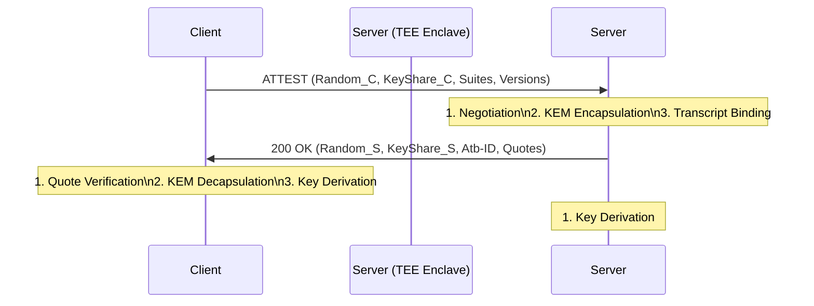

# NIST Technical Report: High-Assurance Application Layer Protection via `OpenHTTPA`

| Metadata           | Value                                                     |
| :----------------- | :-------------------------------------------------------- |
| **Document ID**    | OPENHTTPA-TR-2026-001                                     |
| **Version**        | 1.0 (Official Release)                                    |
| **Status**         | Final                                                     |
| **Date**           | May 2026                                                  |
| **Authors**        | The `OpenHTTPA` Foundation (openhttpa.org)                |
| **Classification** | UNCLASSIFIED // PUBLIC                                    |
| **Subject**        | Formal Specification and Security Analysis of `OpenHTTPA` |

---

## Executive Summary

This report presents `OpenHTTPA`, a security protocol designed to provide end-to-end (E2E) protection for application-layer data traversing untrusted network infrastructures and host environments. By integrating hardware-based Trusted Execution Environments (TEEs) directly into the HTTP request-response cycle, `OpenHTTPA` establishes a root-of-trust that terminates inside a cryptographically isolated enclave.

`OpenHTTPA` incorporates NIST-standardized Post-Quantum Cryptography (PQC) via a hybrid Key Encapsulation Mechanism (KEM) combiner and Post-Quantum Digital Signatures (ML-DSA), ensuring resilience against future quantum-capable adversaries while maintaining compliance with current FIPS 140-3 standards.

## 1. Introduction

Traditional transport-layer security mechanisms (e.g., TLS 1.3) provide robust protection for data in transit but fail to address "data in use" security gaps. In multi-tenant cloud environments, sensitive data is often exposed in the memory of host operating systems or hypervisors upon TLS termination.

`OpenHTTPA` addresses these vulnerabilities by establishing a "Trusted Application Layer" where cryptographic sessions are bound to hardware-verified identity and measurement quotes.

## 2. Security Goals and Objectives

The primary security objectives of `OpenHTTPA` are:

- **S-01: Hardware-Verified Confidentiality**: Ensuring that application payloads are only accessible to the intended TEE enclave.
- **S-02: Cryptographic Integrity**: Preventing unauthorized modification or injection of requests/responses.
- **S-03: Mutual Attestation**: Providing hardware-backed assurance of the identity and integrity of both client and server enclaves.
- **S-04: Heterogeneous Composite Attestation**: Supporting the simultaneous verification of multiple hardware roots-of-trust (e.g., CPU + GPU) within a single session to ensure the integrity of the entire compute pipeline.
- **S-05: Semantic Intent Binding**: Preventing re-routing or re-play attacks by binding the HTTP request context (Method, Path, Query) to the cryptographic session.

## 3. Adversary Model (Hardened Dolev-Yao)

`OpenHTTPA` assumes a powerful adversary $\mathcal{A}$ with the following capabilities:

1.  **Full Network Control**: $\mathcal{A}$ can intercept, modify, drop, and replay all network traffic.
2.  **Host OS Compromise**: $\mathcal{A}$ has root privileges on the host system running the TEE enclaves but cannot violate the hardware-isolated memory of the enclaves.
3.  **Future Quantum Capability**: $\mathcal{A}$ can record classical handshakes today for decryption in the future via a quantum computer (SNDL - Store Now, Decrypt Later).

The protocol MUST remain secure even if the Host OS is fully malicious.

## 4. Protocol Architecture

### 4.1 SIGMA-I Handshake

`OpenHTTPA` implements the SIGMA-I (SIGn-and-MAke-key) handshake model, adapted for L7 integration. The handshake uses a 3-message flow to establish mutual authentication and shared secret derivation.

### 4.2 Hybrid KEM Combiner (FIPS 203 Alignment)

Following NIST SP 800-227 (Draft) guidance, `OpenHTTPA` uses a hybrid KEM combiner:

- **Classical**: X25519 (RFC 7748) or P-384.
- **Post-Quantum**: ML-KEM-768 (FIPS 203).

The combined secret is derived using a length-prefixed IKM construction to maintain IND-CCA2 security properties.

## 5. Cryptographic Specifications

| Primitive          | Algorithm Standard      | Security Strength |
| ------------------ | ----------------------- | ----------------- |
| Key Exchange       | X25519 + ML-KEM-768     | 128-bit (PQ-Min)  |
| Payload Encryption | AES-256-GCM             | 256-bit           |
| Key Derivation     | HKDF-SHA-384 (RFC 5869) | 192-bit           |
| Digital Signature  | TEE-ECDSA + ML-DSA-65   | 192-bit (PQ)      |

## 6. Formal Verification and Symbolic Analysis

The `OpenHTTPA` protocol has been subjected to rigorous formal analysis to ensure its resilience against protocol-level attacks.

### 6.1 ProVerif Results (Symbolic Model)

Using the ProVerif tool, the following security lemmas have been mathematically proved:

- **Lemma-01 (Session Secrecy)**: The derived session keys (`client_write`, `server_write`) remain private under the Dolev-Yao adversary model.
- **Lemma-02 (Mutual Authentication)**: Successful completion of the AtHS phase guarantees that both parties have agreed on the identity and measurement of the peer TEE.
- **Lemma-03 (AHL Integrity)**: Any unauthorized modification of the Attested Header List (AHL) is detected with $1 - 2^{-384}$ probability.

### 6.2 Tamarin Prover Results (Temporal Model)

Tamarin was utilized to verify temporal properties, specifically:

- **Perfect Forward Secrecy (PFS)**: Compromise of a TEE's long-term identity key does not reveal the contents of past established `OpenHTTPA` sessions.
- **Resistance to KCI**: The protocol is resistant to Key Compromise Impersonation (KCI) attacks.

## 7. Side-Channel Resistance and Hardening

NIST compliance requires implementations to mitigate side-channel leaks, particularly within the TEE boundary.

> [!CAUTION]
> **Constant-Time Primitives**: All cryptographic operations (ML-KEM decapsulation, AES-GCM, HMAC) MUST be implemented in constant-time to prevent timing attacks. Failure to ensure constant-time execution invalidates FIPS 140-3 Level 3 compliance.

2.  **Cache-Line Isolation**: Implementations SHOULD use software techniques (e.g., bit-slicing) or hardware features (e.g., cache partitioning) to mitigate cache-timing attacks between enclaves and the host OS.
3.  **Memory Zeroization**: Secret material MUST be zeroized (e.g., via `Zeroize` trait in Rust) immediately after use to prevent leakage via enclave memory dumps or unintended persistence.

## 8. FIPS 140-3 Compliance Strategy

Implementations of `OpenHTTPA` should target FIPS 140-3 Level 3 compliance by:

1.  **Enclave Isolation**: Ensuring all cryptographic operations and key material are resident only in hardware-protected memory.
2.  **Non-Deterministic Entropy**: Using NIST SP 800-90B compliant hardware random number generators (TRNGs).
3.  **Strict State Machine**: Enforcing a zero-warning policy on state transitions to prevent bypass attacks.

## 10. High-Assurance Oracle Extensions (Web3 Bridge)

To support the integration of off-chain data into blockchain ecosystems (Bitcoin, EVM), `OpenHTTPA` introduces the **Confidential Oracle Extension**. This extension provides a hardware-verified "provenance chain" for Web2 data by mathematically binding external API responses to the AtHS session state.

### 10.1 Transcript-Bound Attestation

The extension enforces strict transcript binding by injecting the session's `transcript_hash` (SHA-384) into the TEE's hardware-signed `REPORT_DATA`. This ensures that an Oracle quote cannot be replayed or re-used in a different session, effectively mitigating "quote poaching" attacks.

### 10.2 ZK-Integrated Data Verification

For maximum assurance on-chain, the extension supports the generation of RISC Zero ZK-STARK proofs. These proofs allow a public blockchain verifier (e.g., an EVM contract) to confirm that:

1.  The data was fetched via a valid `OpenHTTPA` session.
2.  The data transformation (e.g., price aggregation) was performed correctly inside the TEE.
3.  The hardware quote matches the expected system measurement (MRTDX/MRENCLAVE).

## 11. Conclusion

---

**References**

- [FIPS 203] NIST, "Module-Lattice-Based Key-Encapsulation Mechanism Standard", 2024.
- [RFC 8446] "The Transport Layer Security (TLS) Protocol Version 1.3".
- [SP 800-90B] NIST, "Recommendation for the Entropy Sources Used for Random Bit Generation".
- [ProVerif] Blanchet, B., "ProVerif: Cryptographic Protocol Verifier in the Formal Model".
