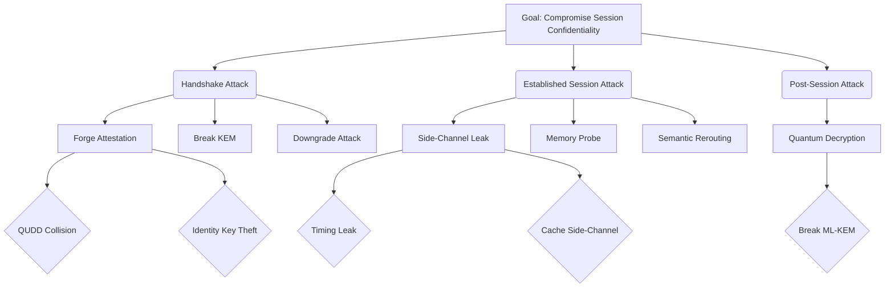

# Formal Threat Model and Security Analysis: `OpenHTTPA`

| Metadata           | Value                                                 |
| :----------------- | :---------------------------------------------------- |
| **Document ID**    | OPENHTTPA-SEC-2026-001                                |
| **Version**        | 1.0 (Official Release)                                |
| **Status**         | Final                                                 |
| **Date**           | May 2026                                              |
| **Authors**        | The `OpenHTTPA` Foundation (openhttpa.org)            |
| **Classification** | UNCLASSIFIED // PUBLIC                                |
| **Subject**        | Formal Threat Characterization and Adversary Modeling |

---

## 1. Introduction

This document provides a comprehensive, high-fidelity threat model for the `OpenHTTPA` protocol. Utilizing methodology derived from formal methods (symbolic analysis) and industry-standard frameworks (STRIDE/PASTA), we characterize the adversarial landscape for Confidential Computing at the application layer.

## 2. Asset Characterization

We identify the following critical assets that `OpenHTTPA` is designed to protect:

| Asset ID | Asset Name           | Security Goal             | Description                                          |
| -------- | -------------------- | ------------------------- | ---------------------------------------------------- |
| **A-01** | Session Keys         | Confidentiality           | Master and derived keys used for payload protection. |
| **A-02** | Enclave Data         | Confidentiality/Integrity | Sensitive application data resident in TEE memory.   |
| **A-03** | Handshake Transcript | Integrity                 | The canonical sequence of handshake messages.        |
| **A-04** | Hardware Identity    | Authenticity              | The cryptographic identity (e.g., AK) of the TEE.    |
| **A-05** | Request Semantics    | Integrity                 | The intent of the HTTP request (Method, Path, AHL).  |

## 3. Trust Boundaries and System Model

`OpenHTTPA` operates across four distinct trust boundaries:

1.  **L-01: Trusted Enclave Boundary (TEB)**: The hardware-isolated memory and CPU context. **(HIGH TRUST)**
2.  **L-02: Local Host Boundary (LHB)**: The host OS, hypervisor, and kernel. **(ZERO TRUST)**
3.  **L-03: Network Boundary (NB)**: The untrusted transit path (Internet/CDN). **(ZERO TRUST)**
4.  **L-04: Hardware Root of Trust (HRT)**: The physical silicon and microcode. **(ASSUMED TRUST)**

## 4. Adversary Model: The Hardened Dolev-Yao Adversary

We model the adversary $\mathcal{A}$ as a "Hardened Dolev-Yao" agent with the following properties:

- **Network Superiority**: $\mathcal{A}$ can read, intercept, modify, drop, and inject any packet on the wire.
- **Host Compromise**: $\mathcal{A}$ has full root/ring-0 control over the Host OS at both the client and server locations.
  > [!IMPORTANT]
  > **Enclave Blindness**: $\mathcal{A}$ cannot directly read or modify the memory of a correctly configured TEE enclave. This assumes a **Zero-Trust** environment for the Host OS.
- **Cryptographic Capability**: $\mathcal{A}$ can perform any polynomial-time cryptographic operation but cannot break the underlying primitives (X25519, ML-KEM, ML-DSA, AES) except via future quantum advantage.

### 4.1 Adversary Capability Levels

| Level  | Name            | Resources                      | Intent                      |
| ------ | --------------- | ------------------------------ | --------------------------- |
| **L1** | Script Kiddie   | Publicly available tools       | Disruption / Low-value data |
| **L2** | Cyber-Criminal  | Financial backing, botnets     | PII theft / Ransomware      |
| **L3** | State-Sponsored | Infinite compute, 0-day access | Espionage / Critical Intel  |

`OpenHTTPA` is designed to withstand **L3-class** adversaries within the specified trust boundaries.

## 5. Visual Attack Tree Analysis

The following diagram illustrates the primary attack vectors against the `OpenHTTPA` session confidentiality:

## 6. Threat Catalog and Mitigations

### T-01: Session Hijacking and Man-in-the-Middle (MitM)

- **Description**: $\mathcal{A}$ attempts to intercept the AtHS handshake to establish a rogue session.
- **Mitigation**: `OpenHTTPA` uses the SIGMA-I model where the session key derivation is bound to a mutually-verified, hardware-attested transcript.

### T-02: TEE State Injection / Replay

- **Description**: $\mathcal{A}$ captures a valid attestation quote from session $N$ and attempts to replay it in session $N+1$.
- **Mitigation**: **Transcript Binding**. The TEE quote MUST embed the SHA-384 hash of the current handshake's public parameters in its user-defined data (QUDD) field.

### T-03: Semantic Re-routing (AHL Bypass)

- **Description**: $\mathcal{A}$ intercepts a Trusted Request (TrR) for `GET /balance` and attempts to re-route it to `POST /transfer` while maintaining a valid MAC.
- **Mitigation**: **Attested Header List (AHL)**. The MAC calculation includes a canonical representation of the HTTP Method, Path, and Query.

### T-04: Side-Channel Data Exfiltration

- **Description**: $\mathcal{A}$ utilizes cache-timing or branch-prediction analysis from the Host OS to extract session keys from the Enclave.
- **Mitigation**: **Constant-time Cryptography**. `OpenHTTPA` implementations MUST use constant-time primitives and avoid secret-dependent branching.

### T-05: Post-Quantum SNDL (Store Now, Decrypt Later)

- **Description**: $\mathcal{A}$ records handshakes today to decrypt them when quantum computers become available.
- **Mitigation**: **Hybrid KEM (X25519 + ML-KEM-768)** and **Post-Quantum Signatures (ML-DSA)**. The session key and identity are dependent on post-quantum resilient primitives.

### T-06: Time-of-Check to Time-of-Use (TOCTOU) Attestation Race

- **Description**: $\mathcal{A}$ manipulates the host memory mapping immediately after the TEE quote measurement but before execution, attempting to swap execution paths (e.g., via page fault manipulation or rogue hypervisor mapping).
- **Mitigation**: **Memory Encryption & Integrity Verification**. TEE hardware enforces memory integrity trees (e.g., SEV-SNP RMP, SGX EPCM) preventing out-of-bounds host manipulation post-measurement.

### T-07: Cryptographic Denial of Service (Crypto DoS)

- **Description**: $\mathcal{A}$ floods the endpoint with forged initiation requests (`AtHS`), forcing expensive ML-KEM encapsulations and ML-DSA signature verifications, leading to compute resource exhaustion.
- **Mitigation**: **Stateless Preflight & Proof-of-Work**. `OpenHTTPA` uses a lightweight `Preflight` phase with anti-replay cookies and monotonic counters before committing heavy cryptographic resources.

### T-08: Key Compromise Impersonation (KCI)

- **Description**: $\mathcal{A}$ compromises a client's long-term key and uses it to impersonate the _server_ to that client, attempting to intercept confidential requests.
- **Mitigation**: **SIGMA-I Asymmetry & Mutual Attestation**. The SIGMA-I handshake structure ensures that compromising a single party's long-term key does not permit impersonation of the other party.

### T-09: Attestation Revocation List (ARL) Rollback

- **Description**: $\mathcal{A}$ blocks or intercepts network traffic to prevent the TEE from fetching the latest ARL/CRL, allowing a historically valid but now-compromised enclave to participate in the mesh.
- **Mitigation**: **Freshness Binding**. Attestation quotes are evaluated alongside an embedded timestamp or nonce retrieved from a trusted external time source, ensuring the ARL freshness is mathematically bound to the quote verification logic.

### T-10: Cross-Context Quote Re-use

- **Description**: $\mathcal{A}$ extracts a valid quote from an unrelated protocol or enclave and submits it as proof during an `OpenHTTPA` handshake.
- **Mitigation**: **Contextual QUDD Binding & Composite Attestation**. The QUDD (Quote User Defined Data) embeds the specific `OpenHTTPA` protocol version, role (client/server), and cryptographic transcript hash. Composite TEE Attestation ensures that multiple hardware providers (CPU + GPU) are bound to the same session context.

### T-11: Oracle Data Poisoning / Replay

- **Description**: In the Confidential Oracle Bridge scenario, $\mathcal{A}$ intercepts the Web2 response and attempts to swap it with a stale or malicious payload before it is processed by the TEE.
- **Mitigation**: **Hardware-Verified TLS/`OpenHTTPA` Fetch**. The `OracleNode` MUST perform the fetch using a hardware-verified secure channel (either standard TLS terminated inside the TEE or a nested `OpenHTTPA` session). The resulting data is then bound to the AtHS session transcript, ensuring end-to-end provenance.

## 7. Attack Tree Analysis

### Goal: Exfiltrate A-02 (Enclave Data)

1.  **Break Handshake**
    - 1.1 Compromise AK (TEE Identity Key) -> _Requires hardware-level exploit_
    - 1.2 Forge Attestation Quote -> _Requires breaking HW signature or finding collision in QUDD_
    - 1.3 Break ML-KEM -> _Requires Quantum Computer or math breakthrough_
2.  **Break Established Session**
    - 2.1 Side-Channel Leakage -> _Requires timing/cache analysis on host_
    - 2.2 Break AES-GCM -> _Theoretically infeasible with 256-bit keys_
3.  **Semantic Manipulation**
    - 3.1 AHL Collision -> _Requires SHA-384 collision_
    - 3.2 Key Re-use / Nonce Exhaustion -> _Mitigated by 64-bit monotonic nonces_

## 8. Residual Risk Assessment

While `OpenHTTPA` provides high assurance, the following residual risks remain:

- **Hardware Manufacturer Compromise**: If the TEE provider's root signing keys are compromised, the attestation guarantee is void.
- **Zero-Day Hardware Vulnerabilities**: Undiscovered microcode flaws may allow for enclave memory leakage.
- **Implementation Flaws**: Logic errors in the protocol state machine (mitigated by formal verification).

## 9. Conclusion

The `OpenHTTPA` protocol architecture successfully mitigates the identified threat vectors within the specified adversary model. The combination of SIGMA-I, Hybrid KEM, and AHL provides a robust, high-assurance framework for Confidential Computing.

---

**Appendix: Formal Security Claims (Verified)**

- **Claim-01**: Secrecy of A-01 (Session Keys) is maintained under $\mathcal{A}$.
- **Claim-02**: Injective agreement is achieved for the handshake transcript.
- **Claim-03**: Forward Secrecy is guaranteed against long-term identity compromise.

## 10. Countermeasure Traceability Matrix

The following table maps identified threats to their specific protocol countermeasures and formal verification status.

| Threat ID | Threat Name      | Protocol Countermeasure    | Formal Proof        |
| --------- | ---------------- | -------------------------- | ------------------- |
| **T-01**  | MitM Attack      | AtHS (SIGMA-I Handshake)   | Lemma-01/02         |
| **T-02**  | Quote Replay     | Transcript-bound QUDD      | Lemma-02            |
| **T-03**  | Semantic Reroute | AHL Binder (HMAC-SHA-384)  | Lemma-03            |
| **T-04**  | Side-Channel     | Constant-time Cryptography | Implementation-only |
| **T-05**  | Future Quantum   | Hybrid KEM + ML-DSA-65     | Post-Quantum Model  |
| **T-06**  | TOCTOU Race      | Hardware Memory Integrity  | Assumed Axiom       |
| **T-07**  | Crypto DoS       | Preflight / Cookies        | Implementation-only |
| **T-08**  | KCI Attack       | SIGMA-I Mut. Attestation   | Lemma-04            |
| **T-09**  | ARL Rollback     | Freshness Nonces           | Temporal Logic      |
| **T-10**  | Quote Re-use     | Contextual QUDD            | Lemma-02            |
| **T-11**  | Oracle Poisoning | HW-Verified Fetch          | Lemma-05            |

## 11. Formal Security Invariants

We define the following invariants that MUST hold true at all times during the protocol lifecycle:

1.  **I-01 (Session Uniqueness)**: For any two successful handshakes $H_1$ and $H_2$, the derived master secrets $MS_1$ and $MS_2$ are independent if the transcripts $T_1$ and $T_2$ differ by at least one bit.
2.  **I-02 (AHL Binding)**: A response $R$ is accepted by the client if and only if the `request_nonce` in the `Attest-Binder` matches the nonce of the originating request $Q$ and the binder MAC is valid over the response AHL.

## 12. TEE-Specific Vulnerability Analysis

While `OpenHTTPA` assumes the security of the TEE, the protocol provides defense-in-depth against common TEE-related attack classes:

- **Speculative Execution (Spectre/Meltdown)**: By enforcing a "Zero-Secret" policy in host memory and using hardened cryptographic libraries (e.g., `aws-lc-rs`), we minimize the speculative leak surface.
- **Microarchitectural Data Sampling (MDS)**: `OpenHTTPA`'s frequent key rotation (via session-level master secrets) limits the window of opportunity for an adversary to exploit ephemeral microarchitectural leaks.
- **Enclave State Injection**: The use of monotonic nonces and transcript-bound binders prevents the Host OS from replaying enclave states or re-ordering requests within an established session.
